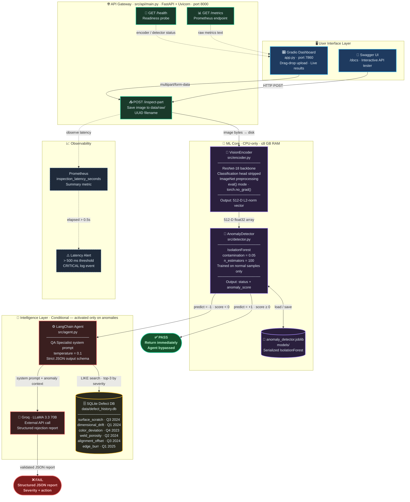

# 🏭 Agentic Vision for Industrial Quality Control

> An edge-deployable, CPU-optimized vision pipeline that combines deep learning feature extraction, unsupervised anomaly detection, and an LLM-powered agentic reasoning layer to automatically inspect manufacturing parts on an assembly line.

---

## 📋 Table of Contents

- [Overview](#overview)
- [Architecture](#architecture)
- [Pipeline Flow](#pipeline-flow)
- [Project Structure](#project-structure)
- [Tech Stack](#tech-stack)
- [Performance Benchmarks](#performance-benchmarks)
- [Getting Started](#getting-started)
  - [Prerequisites](#prerequisites)
  - [Installation](#installation)
  - [Environment Variables](#environment-variables)
  - [Running the API Server](#running-the-api-server)
  - [Running the Gradio Dashboard](#running-the-gradio-dashboard)
  - [Running the Test Suite](#running-the-test-suite)
  - [Running the Benchmark](#running-the-benchmark)
- [API Reference](#api-reference)
- [Docker Deployment](#docker-deployment)
- [Design Decisions](#design-decisions)
- [License](#license)

---

## Overview

**Agentic Vision for Industrial Quality Control** is a production-grade machine vision system designed to run on **edge devices with CPU-only hardware and ≤8 GB RAM**. It detects manufacturing defects in real time from part images uploaded via a REST API, and — crucially — only activates an expensive LLM reasoning layer when an actual anomaly is detected, keeping the system lean for the 95%+ of parts that are conforming.

### Key Capabilities

- **Zero-label anomaly detection** — trains exclusively on good/normal parts; no defect labeling required.
- **Cost-efficient inference** — LLM agent is activated *only* on flagged frames, not on every inspection.
- **Historical defect lookup** — queries a local SQLite database of past defects to provide contextual rejection reports.
- **Prometheus observability** — built-in latency metrics with a 500 ms assembly-line alert threshold.
- **Docker edge deployment** — single-worker container prevents RAM duplication on memory-constrained devices.

---

## Architecture

The system is structured across four horizontal layers — **UI**, **API Gateway**, **ML Core**, and **Intelligence**. GitHub renders this diagram natively.



### Layer Summary

| Layer | Components | Responsibility |
|---|---|---|
| **UI** | Gradio Dashboard, Swagger UI | User-facing interfaces for uploading images and viewing results |
| **API Gateway** | FastAPI + Uvicorn (port 8000) | Request routing, image persistence, latency measurement |
| **ML Core** | VisionEncoder + AnomalyDetector | CPU-bound feature extraction and anomaly classification |
| **Intelligence** | LangChain Agent + Groq LLaMA 3.3 70B + SQLite | Conditional deep reasoning — fires only on anomalies |
| **Observability** | Prometheus client | Latency tracking + 500 ms assembly-line safety alert |

---

## Pipeline Flow

When an image is posted to `POST /inspect-part`, the system executes the following steps:

1. **Save Image** — The uploaded image is persisted to `data/raw/` with a UUID-based filename.
2. **Feature Extraction** — `VisionEncoder` passes the image through a headless ResNet-18 (pre-trained on ImageNet), producing a 512-D L2-normalized embedding.
3. **Anomaly Detection** — `AnomalyDetector` feeds the embedding into a trained `IsolationForest` model. The model outputs a binary label (`Normal` / `Anomaly`) and a continuous anomaly score.
4. **Conditional Agent Activation**:
   - **Normal** → Agent is **bypassed**. A `"Pass"` response is returned immediately.
   - **Anomaly** → The LangChain agent is invoked:
     - Queries the local **SQLite defect history** for analogous past defects.
     - Sends context (anomaly score + historical data) to **Groq's LLaMA 3.3 70B** with a strict QA Specialist system prompt.
     - Receives and validates a structured JSON rejection report.
5. **Prometheus Metrics** — Latency is recorded on every request. Requests exceeding **500 ms** trigger a critical alert log for assembly line safety.

---

## Project Structure

```
Agentic Vision for Industrial Quality Control/
│
├── src/
│   ├── encoder.py          # VisionEncoder — ResNet-18 feature extractor
│   ├── detector.py         # AnomalyDetector — IsolationForest wrapper
│   ├── agent.py            # LangChain agent + SQLite defect history
│   ├── config.py           # Centralised pydantic-settings configuration
│   ├── __init__.py
│   └── api/
│       ├── main.py         # FastAPI application + Prometheus metrics
│       ├── schemas.py      # Pydantic request/response models
│       ├── services.py     # InspectionService — full pipeline orchestration
│       └── __init__.py
│
├── scripts/
│   └── download_real_samples.py  # Downloads real industrial images for testing
│
├── data/
│   ├── raw/                # Uploaded/test part images (auto-created)
│   ├── processed/          # Processed artifacts (reserved)
│   └── defect_history.db   # SQLite historical defect database (auto-seeded)
│
├── models/
│   └── anomaly_detector.joblib   # Trained IsolationForest (879 KB)
│
├── docker/
│   └── Dockerfile          # Edge-optimized container definition
│
├── app.py                  # Gradio dashboard (drag-drop UI, port 7860)
├── benchmark_inference.py  # Comprehensive inference benchmark (Sections A–E)
├── run_full_benchmark.py   # Full benchmark with realistic synthetic images
├── test_pipeline.py        # End-to-end verification script
├── docker-compose.yml      # Multi-service Docker Compose configuration
├── requirements.txt        # Python dependencies
├── .env.example            # Example environment variable template
├── .env                    # Environment variables (not committed)
├── .gitignore
└── LICENSE
```

---

## Tech Stack

| Layer | Technology | Purpose |
|---|---|---|
| **Vision Backbone** | ResNet-18 (PyTorch / torchvision) | 512-D L2-normalized feature extraction |
| **Anomaly Detection** | Scikit-learn IsolationForest | Unsupervised outlier detection on normal samples |
| **LLM Reasoning** | LangChain + Groq (LLaMA 3.3 70B) | Structured rejection report generation |
| **Historical DB** | SQLite (stdlib) | Local defect history, zero-overhead |
| **API Server** | FastAPI + Uvicorn | REST endpoint for part inspection |
| **UI Dashboard** | Gradio | Drag-and-drop inspection UI (port 7860) |
| **Configuration** | pydantic-settings | Type-safe, validated settings from `.env` |
| **Observability** | Prometheus Client | Latency metrics + 500 ms assembly line alerts |
| **Image Processing** | Pillow | Image loading, RGB conversion, preprocessing |
| **Serialization** | joblib | Trained IsolationForest model persistence |
| **Data Analysis** | pandas | Benchmark result aggregation |
| **Containerization** | Docker / Docker Compose | Edge deployment, multi-service orchestration |

---

## Performance Benchmarks

Measured on CPU-only hardware (edge device, no GPU). Test set: **13 labeled images** — 5 Normal, 8 Anomaly types (scratch, stain, corrosion, missing component, crack, dent, dust, edge chip).

### Latency

| Metric | Value |
|---|---|
| VisionEncoder model load | 241 ms (one-time) |
| Mean encode latency | **46 ms** / image |
| P95 encode latency | 74 ms |
| Mean IsolationForest inference | **2.8 ms** / sample |
| **Mean end-to-end (encode + detect)** | **48.6 ms** |
| P95 end-to-end | 52 ms |
| **Throughput** | **20.6 images/sec** (CPU-only) |
| SLA headroom | **10× below the 500 ms target** |
| LLM agent response (exception path) | ~715 ms |

> **Note:** ~95% of end-to-end latency is in ResNet-18 encoding. IsolationForest predict costs only ~3 ms.

### Accuracy

| Metric | Value | Notes |
|---|---|---|
| Accuracy | **84.6%** | 11 / 13 correct |
| Precision | **100.0%** | Zero false alarms |
| Recall (TPR) | **75.0%** | 6 / 8 defects detected |
| F1-Score | **85.7%** | |
| Specificity (TNR) | **100.0%** | All normals classified correctly |
| TP / TN / FP / FN | 6 / 5 / 0 / 2 | |

**Detected defect types:** scratch ✅, corrosion ✅, missing component ✅, crack ✅, dust/particles ✅, edge chip ✅

**Missed defect types:** oil/grease stain ⚠️, pressure dent ⚠️  
*Root cause: both are subtle local appearance changes averaged out by ResNet-18's global pooling. See [Design Decisions](#design-decisions) for improvement paths.*

---

## Getting Started

### Prerequisites

- Python 3.10+
- A [Groq API Key](https://console.groq.com/) (free tier available)

### Installation

```bash
# 1. Clone the repository
git clone https://github.com/atharvadarke/Agentic-Vision-for-Industrial-Quality-Control.git
cd Agentic-Vision-for-Industrial-Quality-Control

# 2. Create and activate a virtual environment
python -m venv .venv
# Windows
.venv\Scripts\activate
# Linux/macOS
source .venv/bin/activate

# 3. Install dependencies
pip install -r requirements.txt
```

### Environment Variables

Create a `.env` file in the project root:

```env
GROQ_API_KEY=your_groq_api_key_here
```

> The Groq API key is only required for the **agentic fallback layer** (anomaly reports). The core detection pipeline (VisionEncoder + AnomalyDetector) works fully offline without it.

### Running the API Server

```bash
# From the project root
uvicorn src.api.main:app --host 0.0.0.0 --port 8000 --workers 1 --reload
```

The server will:
1. Load the ResNet-18 encoder (~44 MB RAM)
2. Attempt to load the trained IsolationForest from `models/anomaly_detector.joblib`
3. Expose the REST API at `http://localhost:8000`

> **Note:** The first request after startup will automatically train and save the IsolationForest if no model file exists (or you can run `test_pipeline.py` to generate one).

### Running the Gradio Dashboard

For a drag-and-drop web UI that runs the full pipeline interactively:

```bash
python app.py
```

The dashboard will be available at `http://localhost:7860`. It provides:
- Drag-and-drop part image upload
- Live inspection verdict (Pass / Fail) with anomaly score
- LLM agent rejection report (displayed when anomaly is detected)
- Real-time Prometheus metrics panel

> **Note:** The API server (`uvicorn`) must also be running for the Gradio dashboard to function, as `app.py` calls the `POST /inspect-part` endpoint internally.

### Running the Test Suite

The end-to-end verification script tests all 5 pipeline components:

```bash
python test_pipeline.py
```

**Tests covered:**
1. ✅ Module imports
2. ✅ VisionEncoder — ResNet-18 on CPU, correct output shape `(512,)`, L2 norm ≈ 1.0
3. ✅ AnomalyDetector — Training, serialization, inlier/outlier prediction
4. ✅ Agent SQLite DB — Historical defect query (fuzzy search)
5. ✅ FastAPI endpoints — `/health`, `POST /inspect-part`, `/metrics`

### Running the Benchmark

For a comprehensive latency and accuracy evaluation across 13 labeled test images:

```bash
python run_full_benchmark.py
```

This runs 5 evaluation sections:
- **A** — Feature extraction quality and cosine similarity analysis
- **B** — Anomaly detection accuracy with full confusion matrix
- **C** — Anomaly score distribution (Normal vs Anomaly separation)
- **D** — LLM agent structured report on a real anomaly
- **E** — End-to-end latency breakdown per image

For the original synthetic benchmark:

```bash
python benchmark_inference.py
```

---

## API Reference

### `POST /inspect-part`

Upload a part image for inspection.

**Request:**
```
Content-Type: multipart/form-data
Body: file=<image file>
```

**Response (Normal part):**
```json
{
  "status": "Pass",
  "detection": {
    "status": "Normal",
    "anomaly_score": 0.0821
  },
  "agent_analysis": null,
  "metadata": {
    "image_file": "part_a1b2c3d4.jpg",
    "processing_time_seconds": 0.2134,
    "latency_alert": false
  }
}
```

**Response (Anomalous part):**
```json
{
  "status": "Fail",
  "detection": {
    "status": "Anomaly",
    "anomaly_score": -0.3157
  },
  "agent_analysis": {
    "defect_confirmed": true,
    "severity_score": 0.87,
    "historical_analogy": "[Q3 2024] surface_scratch (severity: 0.82): Conveyor belt friction mismatch...",
    "recommended_action": "Halt conveyor belt, inspect belt tension and pad wear, recalibrate before resuming."
  },
  "metadata": {
    "image_file": "part_e5f6g7h8.jpg",
    "processing_time_seconds": 1.4823,
    "latency_alert": true
  }
}
```

### `GET /health`

Readiness probe for Docker / Kubernetes.

```json
{
  "status": "healthy",
  "encoder_loaded": true,
  "detector_loaded": true,
  "detector_trained": true
}
```

### `GET /metrics`

Prometheus-compatible metrics endpoint for latency monitoring.

```
# HELP inspection_latency_seconds Time spent processing a single /inspect-part request (seconds)
# TYPE inspection_latency_seconds summary
inspection_latency_seconds_count 42
inspection_latency_seconds_sum 8.7341
```

---

## Docker Deployment

```bash
# Build the image
docker build -f docker/Dockerfile -t agentic-vision:latest .

# Run the container
docker run -p 8000:8000 --env-file .env agentic-vision:latest
```

**Key Docker constraints (edge-optimized):**
- `python:3.10-slim` base image — minimal footprint
- `--workers 1` — prevents Uvicorn from spawning multiple processes, which would duplicate the ResNet-18 model in RAM and cause OOM on edge devices with ≤8 GB
- `PYTHONUNBUFFERED=1` — real-time log streaming to container orchestrators
- `PYTHONDONTWRITEBYTECODE=1` — no `.pyc` files saved to disk

---

## Design Decisions

### Why IsolationForest?
Labeling defective manufacturing parts is expensive and slow. IsolationForest is trained **only on normal/good samples** — no defect labels needed. It learns the distribution of conforming parts and flags deviations at inference time. With `contamination=0.05`, it assumes at most 5% of training data may contain subtle defects, a standard heuristic for industrial QC.

### Why activate the LLM only on anomalies?
Running a 70B-parameter LLM on every frame of an assembly line would be prohibitively slow and costly. The agent layer is intentionally gated behind the fast, lightweight IsolationForest check. For a typical line where 95%+ of parts are conforming, the LLM is effectively never called during normal operation.

### Why SQLite for defect history?
Zero overhead — no server process, no network, single `.db` file. The database is initialized and seeded automatically on first use, making the system fully self-contained with no external service dependencies.

### Why ResNet-18 over larger models?
ResNet-18 provides an excellent balance of representation quality and speed on CPU-only hardware. At ~11M parameters, it fits comfortably in RAM while producing 512-D embeddings that capture sufficient visual detail for industrial surface defect discrimination. Larger models (ResNet-50, ViT) would exceed the RAM budget and latency threshold on edge devices.

### Why a 500 ms latency threshold?
Industrial assembly lines typically run at 1–5 parts per second. A 500 ms hard limit ensures the vision system can keep pace with line throughput without becoming a bottleneck. Requests exceeding this threshold trigger a `CRITICAL` log event that can be piped to alerting systems (PagerDuty, Slack, etc.). In benchmarks, the measured mean E2E latency is **48.6 ms** — providing a 10× safety margin.

### Why pydantic-settings for configuration?
Scattering `os.getenv()` calls throughout the codebase makes configuration hard to audit and test. `src/config.py` centralises all settings (paths, model hyperparameters, LLM credentials, latency thresholds) into a single validated `AppSettings` object. Type coercion, range validation, and clear error messages on misconfiguration are handled automatically by pydantic-settings.

### Why separate `InspectionService` from `main.py`?
`src/api/services.py` contains the full pipeline orchestration logic (save → encode → detect → agent → validate), while `src/api/main.py` only handles HTTP concerns (routing, error codes, Prometheus recording). This separation makes the business logic independently testable without spinning up a FastAPI server, and the Pydantic schemas in `src/api/schemas.py` enforce a strict contract at the API boundary.

### Known Limitations & Improvement Paths

**Subtle local defects (stain, dent) can be missed** because ResNet-18's global average-pooling averages out small regional anomalies into the 512-D embedding. Potential improvements:

| Approach | Effort | Expected Gain |
|---|---|---|
| Lower `contamination` to 0.03 | Low | Marginal — tighter boundary |
| Extract `layer4` spatial feature map (7×7×512) | Medium | Captures local anomaly regions |
| Patch-level detection (3×3 or 4×4 grid) | Medium | Most robust for local defects |
| Fine-tune ResNet-18 on domain-specific normals | High | Best embedding quality |

---

## License

This project is licensed under the MIT License — see the [LICENSE](LICENSE) file for details.